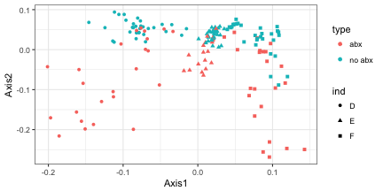

# Adaptive gPCA

## Description

Adaptive gPCA, described in
[Fukuyama 2017](https://arxiv.org/abs/1702.00501), is a flexible
method for incorporating side information into principal components
analysis. It was developed for using information about the
phylogenetic structure of bacteria in microbiome data analysis, but it
is applicable to more general kinds of structure. 

## Installation

Adaptive gPCA is implemented in the R package adaptiveGPCA, which can
be installed either from CRAN or github. To install from CRAN use
```r
install.packages("adaptiveGPCA")
```

## Quick start for microbiome data

The package comes with a [full vignette](https://cran.r-project.org/web/packages/adaptiveGPCA/vignettes/adaptive_gpca_vignette.html), which explains all of the functions and their arguments. To get a feel for what the package does, you can try out the following commands, which run adaptive gPCA on an example microbiome dataset that comes with the package.

First we load the required packages

```r
library(adaptiveGPCA)
library(ggplot2)
library(phyloseq)
```

Then load the example data, which is stored as a phyloseq object, and process it to get the correct input for adaptive gPCA. 

```r
data(AntibioticPhyloseq)
pp = processPhyloseq(AntibioticPhyloseq)
```

The next command creates a sequence of ordinations with a range of values for the structure parameter, going from no structure to maximal structure. The `visualizeFullFamily` function will open a browser window andallows you to see the effect of changing this parameter interactively.

```r
out.ff = gpcaFullFamily(pp$X, pp$Q, k = 2)
out.agpca = visualizeFullFamily(out.ff,
    sample_data = sample_data(AntibioticPhyloseq),
    sample_mapping = aes(x = Axis1, y = Axis2, color = type),
    var_data = tax_table(AntibioticPhyloseq),
    var_mapping = aes(x = Axis1, y = Axis2, color = Phylum))
```

The `adaptivegpca` function chooses the structure parameter automatically, and we can make plots of the samples and species corresponding to that value of the structure parameter. 

```r
out.agpca = adaptivegpca(pp$X, pp$Q, k = 2)
ggplot(data.frame(out.agpca$U, sample_data(AntibioticPhyloseq))) +
    geom_point(aes(x = Axis1, y = Axis2, color = type, shape = ind))
```



```r
ggplot(data.frame(out.agpca$QV, tax_table(AntibioticPhyloseq))) +
    geom_point(aes(x = Axis1, y = Axis2, color = Phylum))
```


Finally, the `inspectTaxonomy` function will open a browser window that allows you to get more information about the taxa in the plot above. 

```r
t = inspectTaxonomy(out.agpca, AntibioticPhyloseq)
```
